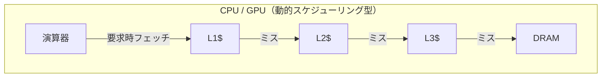
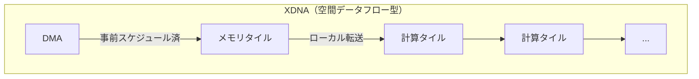
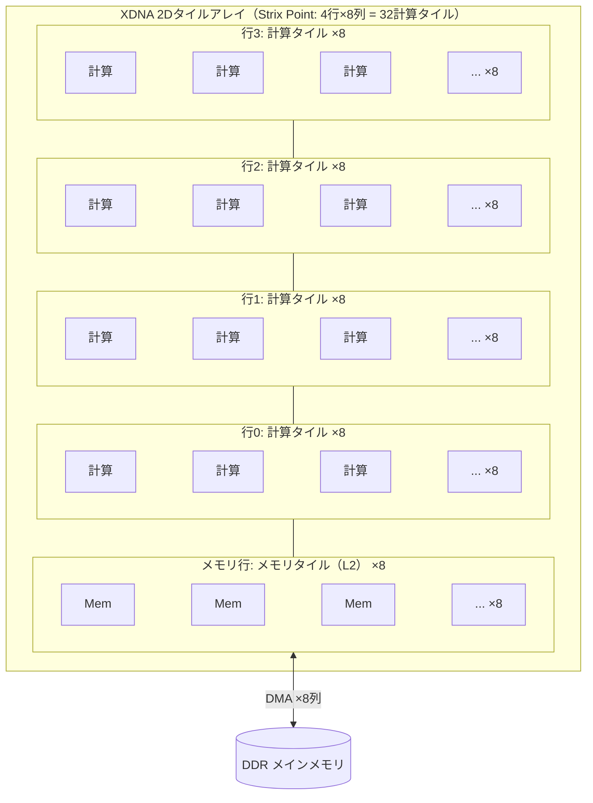
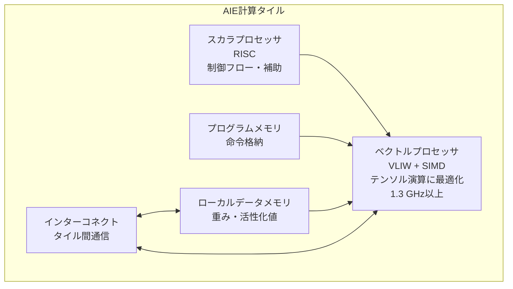
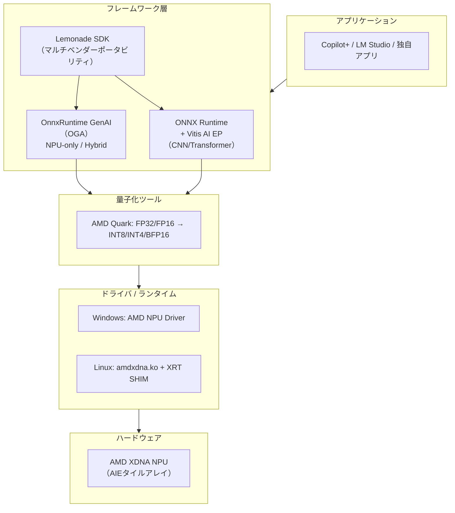

# AMD XDNAアーキテクチャ概要

作成日時: 2026-03-28 15:31:57
更新日時: 2026-03-31 12:00:00

文責: 濱田 剛(Tsuyoshi Hamada)
Contact email: hamada@degima.ai

## 概要

AMD XDNAは、AMDのクライアントAPUに統合されたNPU（Neural Processing Unit）のマイクロアーキテクチャです。2022年にAMDが約350億ドルで買収したXilinxのVersal AI Engine技術を起源とし、機械学習やAI推論に特化した**空間データフロー（spatial dataflow）**アーキテクチャを採用しています。

従来のCPUやGPUが「キャッシュから繰り返しデータを取り出す」動的スケジューリング型であるのに対し、XDNAは**オンチップメモリとDMAによる決定論的なデータ移動**でAI演算を行います。これにより、CPUと比べて10〜40倍、GPUと比べて44%少ない消費電力で同等のAI推論を実現するとされています。

本稿では、XDNAの設計思想、タイル構造、世代別の進化、ソフトウェアスタック、競合NPUとの比較、実際の利用シーンまでを整理します。

## 3行で要点

- XDNAはXilinx Versal AI Engineを起源とする**空間データフロー型NPU**で、2D配列のAIEタイルが並列にデータを処理する。
- 世代ごとにタイル数・メモリ・データ型サポートが拡充され、XDNA（10 TOPS）→ XDNA 2（55 TOPS）→ 第3世代（10倍超）と急速に進化している。
- NPU上のLLM推論は**OnnxRuntime GenAI（OGA）**が担い、Copilot+ PC要件（40 TOPS以上）を満たすAI PC向けNPUの中核を担っている。

## 技術的起源：Xilinx AI Engineから AMD XDNAへ

XDNAを理解するには、その技術的なルーツを知ることが助けになります。

### Xilinx と FPGA の歴史

Xilinxは1984年創業のFPGAの発明者です。

| 年 | 出来事 |
|:--|:--|
| 1984 | Xilinx創業。世界初のファブレス半導体企業、FPGAを発明 |
| 1994 | Virtex FPGA発表 |
| 2012 | Zynq SoC発表（ARM + FPGA統合） |
| ~2014 | Xilinx、7nm Versal ACAP（コードネーム**Project Everest**）の開発を開始。10億ドル超・1,500名以上のエンジニアを投入 |
| 2016年3月 | 清華大学発のAIスタートアップ**DeePhi Technology（深鑑科技）**が設立 |
| 2018年7月 | XilinxがDeePhi Technologyを買収。DPU（Deep Processing Unit）IPとニューラルネットワーク圧縮技術を獲得 |
| 2018年 | Versal 7nmチップのテープアウト（37億トランジスタ） |
| 2019 | Versal ACAP発表（プロセッサコア + プログラマブルロジック + **AI Engine**） |
| 2020年10月 | AMDがXilinx買収を発表 |
| 2022年2月 | AMD、Xilinx買収完了（約350億ドル、全株式交換） |
| 2023年4月 | **AMD XDNA**として初代をRyzen 7040に搭載 |

### Versal AI Engine → XDNA

Xilinxが2019年に発表したVersal ACAPには「AI Engine（AIE）」と呼ばれるタイル型の演算アレイが搭載されていました。このAIEは、FPGAロジックに隣接する空間データフローエンジンとして、5G通信やレーダー信号処理向けに設計されたものです。

AMD XDNAは、このAIEをクライアントAPU向けに再設計・最適化した技術です。データセンター向けのVersal AIEと共通の設計思想（タイル配列、VLIW+SIMD、DMAベースのデータ移動）を持ちながら、低消費電力のノートPC・エッジデバイス向けにチューニングされています。

### 補足：DeePhi Technology（深鑑科技）との関係

XDNAの技術的ルーツを辿るうえで、XilinxによるDeePhi Technology（深鑑科技）の買収も重要なトピックです。両者には深い関わりがありますが、技術的な系譜としては区別して理解するとよりクリアになります。

**DeePhi Technology**は2016年に清華大学の卒業生（姚頌、汪玉、韓松、単羿）によって設立されたAIチップスタートアップで、FPGA上でニューラルネットワーク推論を効率化するDPU（Deep Processing Unit）ソフトIPと、ニューラルネットワークの枝刈り・圧縮技術（Deep Compression）を開発していました。Xilinxは2017年からDeephiに出資し、2018年7月に買収しています。

しかし、XDNAの直接の祖先であるVersal AI Engineは、Xilinx社内でIvo Bolsens（CTO）率いるチームが設計したものです。Versalの開発プロジェクト（Project Everest）は**2014年頃に開始**されており、DeePhi設立（2016年）の約2年前です。10億ドル超の投資と1,500名以上のエンジニアが投入された大規模プロジェクトでした（[VentureBeat, 2018](https://venturebeat.com/business/xilinx-spent-1-billion-over-4-years-to-make-adaptable-computing-chip/)）。

両者の技術的な関係は以下のとおりです。

| | Versal AI Engine → XDNA | DeePhi DPU → Vitis AI |
|:--|:--|:--|
| 技術レベル | シリコン（ハードウェア） | ソフトIP / オーバーレイ |
| 本質 | 硬化されたVLIWベクトルプロセッサタイルの2Dアレイ | FPGA / AI Engineリソース上で動作するDNN推論IPコア |
| 関係 | DPUが動作する**基盤** | AI Engineの**上で**動作するソフトウェア層 |

DeePhi技術は買収後、Xilinx（現AMD）の**Vitis AIフレームワーク**に統合され、DPU IPやモデル最適化ツール（枝刈り・量子化）としてAI Engineハードウェアの上で活用されています。XDNAのハードウェアアーキテクチャとDeePhi由来のソフトウェア技術は、それぞれ独立した起源を持ちながら「基盤と応用」として組み合わさることで、現在のAMD AIプラットフォームを形づくっています。

## XDNAアーキテクチャの基本構造

### 空間データフロー（spatial dataflow）とは

一般的なCPU/GPUは、演算器が必要なデータをキャッシュ階層（L1→L2→L3→DRAM）から**動的に**フェッチします。この動的スケジューリングはフレキシブルですが、キャッシュミス時の待ち時間やフェッチ自体のエネルギーコストが発生します。

XDNAの空間データフローアーキテクチャでは、考え方が根本的に異なります。





データの移動経路とタイミングがコンパイル時に決まるため、実行中のキャッシュミスという概念がなく、消費電力を大幅に抑えられます。

### シストリックアレイとの違い

2Dに並んだ演算要素間をデータが流れるという外見上の類似から、XDNAはシストリックアレイ（Google TPU等で採用）と混同されやすいですが、両者は設計思想が異なります。

| 特性 | シストリックアレイ（TPU等） | AMD XDNA AIEタイルアレイ |
|:--|:--|:--|
| 処理要素の性質 | 固定機能PE（MAC演算等にハードワイヤード） | **プログラマブルプロセッサ**（VLIW+SIMD＋スカラRISC、各タイルに命令メモリ） |
| データフロー | ハードウェアトポロジで決まる一定リズムの波状伝搬 | **プログラマブルDMAとインターコネクト**でソフトウェア制御 |
| 各要素の独立性 | 全PEが同一演算を実行 | 各タイルが**異なるプログラムを独立実行**可能 |
| 並列性の種類 | 主にデータ並列（行列演算に特化） | 空間並列・タスク/パイプライン並列・命令レベル並列を選択可能 |
| 柔軟性 | 特定演算パターン（GEMM、畳み込み）に最適化、それ以外は不得手 | CGRA（粗粒度再構成可能アーキテクチャ）として多様なワークロードに対応 |
| 再構成 | 不可（ハードウェア固定） | ファームウェア更新でタイルの役割やデータフローを変更可能 |

XDNAのAIEタイルアレイは、シストリックアレイ的なデータフローパターンを並列性の選択肢の**一つとして実装できる**、より汎用的なアーキテクチャです。Xilinxのホワイトペーパー[WP506: Xilinx AI Engines and Their Applications](https://spiritelectronics.com/pdf/wp506-ai-engine.pdf)では、AIEの並列性として命令レベル並列（6-way VLIW）とデータレベル並列（512bit SIMD）を明記し、さらにタイル間の通信としてカスケードインターフェース（隣接タイルへの部分結果の直接転送）をサポートすると記載しています。このカスケードインターフェースにより、シストリックアレイ的な波状データ伝搬パターンを実装できますが、それは各タイルのプログラマブルなDMA・AXI-Streamインターコネクトが提供する柔軟なデータ移動の一形態です。AIEアーキテクチャの詳細は[AM009: Versal AI Engine Architecture Manual](https://docs.amd.com/r/en-US/am009-versal-ai-engine/AI-Engine-Array-Overview)も参照してください。

### 2Dタイルアレイ

XDNAの心臓部は「2Dタイルアレイ」です。計算タイル（Compute Tile）とメモリタイル（Memory Tile）がグリッド状に配置されています。



- **計算タイル（Compute Tile）**: 各行の要素。AI演算を実行する
- **メモリタイル（Memory Tile）**: 各列の最下行。L2キャッシュとして機能し、DDRとの間のデータステージングを担う
- **DMAエンジン**: 各列に専用のDMAが配置され、ホストDDRとメモリタイル間のデータ転送を担当

### AIE計算タイルの内部構造

各計算タイルは、小さな独立したプロセッサのような構造を持っています。



| 構成要素 | 役割 |
|:--|:--|
| ベクトルプロセッサ（VLIW + SIMD） | 行列積・畳み込みなどのテンソル演算を並列実行。1.3 GHz以上で動作 |
| スカラプロセッサ（RISC） | 制御フロー、アドレス計算、補助的な処理を担当 |
| プログラムメモリ | タイルが実行する命令を格納 |
| ローカルデータメモリ | 重み、活性化値、係数などを格納。外部DRAMへのアクセスを最小化 |
| プログラマブルインターコネクト | 隣接タイルとの高帯域・低遅延なデータ通信を提供 |

「タイル1つが小さな専用プロセッサ」であり、このタイルが数十個並んで協調動作するのがXDNAの本質です。

### 行列積（GEMM）の実行イメージ

NPUの最も重要なワークロードは行列積（General Matrix Multiplication, GEMM）です。XDNAでのGEMM実行は概ね以下のように進みます。

1. **タイリング**: 大きな行列を小さなブロック（タイル）に分割
2. **DMA転送**: DMAエンジンがDDRからメモリタイル経由で各計算タイルにブロックを配送
3. **計算**: 各計算タイルのベクトルプロセッサがFMA（積和演算）を実行
4. **蓄積**: 部分積を計算タイル間で受け渡しながら蓄積
5. **書き戻し**: 結果をDMA経由でDDRに返却

行列が複数の計算タイルに分散されて並列に処理されるため、タイル数が増えるほどスループットが向上します。

## 世代別の進化

### 仕様比較

| 項目 | XDNA（初代） | XDNA（Hawk Point） | XDNA 2 |
|:--|:--|:--|:--|
| 登場時期 | 2023年4月 | 2024年 | 2024年 |
| 搭載プロセッサ | Ryzen 7040 (Phoenix) | Ryzen 8040 (Hawk Point) | Ryzen AI 300 (Strix Point) |
| CPUアーキテクチャ | Zen 4 | Zen 4 | Zen 5 |
| タイルトポロジ | 4行 × 5列 | 4行 × 5列 | 4行 × 8列 |
| 計算タイル数 | 20 | 20 | 32 |
| L2メモリ合計 | 2,560 KB | 2,560 KB | 4,096 KB |
| ピーク性能（INT8） | 10 TOPS | 16 TOPS | 55 TOPS |
| BFP16対応 | なし | なし | あり |
| 主な改善点 | — | ファームウェア最適化・クロック向上 | タイル数増、メモリ60%増、BFP16対応、5倍の性能 |

### 初代 XDNA（Phoenix / Hawk Point）

2023年にRyzen 7040シリーズとして登場。AMD初のクライアント向けNPUで、4×5のタイル配列により最大10 TOPSを実現しました。Windows上のAI推論タスクの省電力オフロードが主な用途です。

Hawk Pointはハードウェア的にはPhoenixとほぼ同一ですが、ファームウェア更新とクロック最適化により16 TOPSに向上しました。

### XDNA 2（Strix Point）

2024年にRyzen AI 300シリーズとして登場した第2世代は、大幅な強化が入りました。

- **タイル数**: 20 → 32（60%増）
- **L2メモリ**: 2,560 KB → 4,096 KB（60%増）
- **BFP16（Block Floating Point 16）**: ブロック単位で指数を共有し、INT8に近いメモリ効率でFP16に近い精度を実現する新データ型
- **性能**: 初代比で最大5倍、55 TOPSに到達

XDNA 2はMicrosoftのCopilot+ PC要件（40 TOPS以上）を十分に満たし、ローカルLLM推論の実用的な基盤として位置づけられています。

### 今後のロードマップ

AMDが公開しているロードマップでは、以下の世代が予告されています。

| コードネーム | 時期 | NPU世代 | 備考 |
|:--|:--|:--|:--|
| Gorgon Point | 2026年 | XDNA 2（継続） | Zen 5リフレッシュ |
| Medusa Point | 2027年 | 第3世代XDNA | 現行比10倍以上のAI推論性能 |

第3世代では10倍以上の性能向上が予告されており、オンデバイスでのLLM推論がさらに実用的になることが期待されます。

### XDNA搭載プロセッサ SKU一覧

#### 初代 XDNA — Ryzen 7040シリーズ（Phoenix, 2023年）

対応メモリ: DDR5-5600 / LPDDR5X-7500。プロセスノード: TSMC 4nm。CPU: Zen 4、GPU: RDNA 3。ソケット: FP7 / FP7r2 / FP8。178mm² Phoenix ダイ搭載モデルのみ XDNA NPU（10 TOPS）を内蔵。

| SKU | コア/スレッド | ブースト | iGPU | NPU (TOPS) | cTDP | 市販PC例 |
|:--|:--|:--|:--|:--|:--|:--|
| Ryzen 9 7940HS | 8C/16T | 5.2 GHz | Radeon 780M (12CU) | 10 | 35–54W | ASUS ROG Zephyrus G14 (2023) |
| Ryzen 7 7840HS | 8C/16T | 5.1 GHz | Radeon 780M (12CU) | 10 | 35–54W | Framework Laptop 16 |
| Ryzen 5 7640HS | 6C/12T | 5.0 GHz | Radeon 760M (8CU) | 10 | 35–54W | — |
| Ryzen 7 7840U | 8C/16T | 5.1 GHz | Radeon 780M (12CU) | 10 | 15–30W | Lenovo ThinkPad T14s Gen 4 |
| Ryzen 5 7640U | 6C/12T | 4.9 GHz | Radeon 760M (8CU) | 10 | 15–30W | — |

中国市場向けに Ryzen 9 7940H / Ryzen 7 7840H が存在するが、それぞれ 7940HS / 7840HS と同一仕様（Product ID も共通）。

Ryzen 5 7540U、Ryzen 5 7545U、Ryzen 3 7440U は XDNA NPU を搭載していない。7540U / 7440U は AMD 脚注 GD-220d で明示的に Ryzen AI 対象外とされている。7545U は GD-220d の除外リストにないものの、137mm² の Phoenix 2 ダイ（XDNA IP ブロックを物理的に含まない）を使用しており、製品ページにも AI 仕様の記載がない。

PRO版（法人向け）: Ryzen 7 PRO 7840U、Ryzen 5 PRO 7640U など。Lenovo ThinkPad X13 Gen 4、ThinkPad P14s Gen 4 等で採用。

#### 初代 XDNA（リフレッシュ）— Ryzen 8040シリーズ（Hawk Point, 2024年）

対応メモリ: DDR5-5600 / LPDDR5X-7500。プロセスノード: TSMC 4nm。CPU: Zen 4、GPU: RDNA 3。ソケット: FP7 / FP7r2 / FP8。ファームウェア最適化によりNPU性能が16 TOPSに向上（7040シリーズの10 TOPSから1.6倍）。

| SKU | コア/スレッド | ブースト | iGPU | NPU (TOPS) | cTDP | 市販PC例 |
|:--|:--|:--|:--|:--|:--|:--|
| Ryzen 9 8945HS | 8C/16T | 5.2 GHz | Radeon 780M (12CU) | 16 | 35–54W | — |
| Ryzen 7 8845HS | 8C/16T | 5.1 GHz | Radeon 780M (12CU) | 16 | 35–54W | HP OMEN 17 (2024) |
| Ryzen 7 8840HS | 8C/16T | 5.1 GHz | Radeon 780M (12CU) | 16 | 20–30W | — |
| Ryzen 7 8840U | 8C/16T | 5.1 GHz | Radeon 780M (12CU) | 16 | 15–30W | Lenovo ThinkPad T14 Gen 5 |
| Ryzen 5 8645HS | 6C/12T | 5.0 GHz | Radeon 760M (8CU) | 16 | 35–54W | — |
| Ryzen 5 8640HS | 6C/12T | 4.9 GHz | Radeon 760M (8CU) | 16 | 20–30W | — |
| Ryzen 5 8640U | 6C/12T | 4.9 GHz | Radeon 760M (8CU) | 16 | 15–30W | Acer Swift Go 14 (2024) |
| Ryzen 5 8540U | 6C/12T | 4.9 GHz | Radeon 740M (4CU) | **なし** | 15–30W | — |
| Ryzen 3 8440U | 4C/8T | 4.7 GHz | Radeon 740M (4CU) | **なし** | 15–30W | — |

Ryzen 5 8540U と Ryzen 3 8440U は 137mm² の Phoenix 2 ダイ（Zen 4 + Zen 4c 構成）を使用しており、XDNA NPU を**搭載していない**（GD-220d で明示的に対象外）。

PRO版: Ryzen 7 PRO 8840U、Ryzen 5 PRO 8640U、Ryzen 5 PRO 8540U、Ryzen 3 PRO 8440U（法人向け）。

#### 初代 XDNA（リブランド）— Ryzen 200シリーズ（Hawk Point, 2025年）

対応メモリ: DDR5-5600 / LPDDR5X-7500。プロセスノード: TSMC 4nm。CPU: Zen 4、GPU: RDNA 3。ソケット: FP7 / FP7r2 / FP8。Ryzen 8040シリーズと同一の Hawk Point シリコンだが、命名体系を簡素化（4桁型番＋サフィックス → 3桁型番）。NPU搭載モデルは引き続き16 TOPS。178mm² Phoenix ダイ搭載モデルのみ XDNA NPU を内蔵。

| SKU | コア/スレッド | ブースト | iGPU | NPU (TOPS) | cTDP | 市販PC例 |
|:--|:--|:--|:--|:--|:--|:--|
| Ryzen 9 270 | 8C/16T | 5.2 GHz | Radeon 780M (12CU) | 16 | 35–54W | — |
| Ryzen 7 260 | 8C/16T | 5.1 GHz | Radeon 780M (12CU) | 16 | 35–54W | — |
| Ryzen 7 250 | 8C/16T | 5.1 GHz | Radeon 780M (12CU) | 16 | 15–30W | — |
| Ryzen 5 240 | 6C/12T | 5.0 GHz | Radeon 760M (8CU) | 16 | 35–54W | — |
| Ryzen 5 230 | 6C/12T | 4.9 GHz | Radeon 760M (8CU) | 16 | 15–30W | — |
| Ryzen 5 220 | 6C/12T | 4.9 GHz | Radeon 740M (4CU) | **なし** | 15–30W | — |
| Ryzen 3 210 | 4C/8T | 4.7 GHz | Radeon 740M (4CU) | **なし** | 15–30W | — |

Ryzen 5 220 と Ryzen 3 210 は 137mm² の Phoenix 2 ダイ（Zen 4 + Zen 4c 構成）を使用しており、XDNA NPU を**搭載していない**（GD-220e で明示的に対象外）。

PRO版: Ryzen PRO 200シリーズ（法人向け）。Ryzen 5 220 / Ryzen 3 210 を除き Ryzen AI 対応。

#### XDNA 2 — Ryzen AI 300シリーズ（Strix Point / Krackan Point, 2024–2025年）

対応メモリ: DDR5-5600 / LPDDR5X-8000。プロセスノード: TSMC 4nm。CPU: Zen 5 + Zen 5c（ハイブリッド）、GPU: RDNA 3.5。ソケット: FP8。Copilot+ PC対応（40 TOPS以上）。

**Strix Point（上位）**:

| SKU | コア/スレッド | ブースト | iGPU | NPU (TOPS) | cTDP | 市販PC例 |
|:--|:--|:--|:--|:--|:--|:--|
| Ryzen AI 9 HX 375 | 12C/24T | 5.1 GHz | Radeon 890M (16CU) | 55 | 15–54W | — |
| Ryzen AI 9 HX 370 | 12C/24T | 5.1 GHz | Radeon 890M (16CU) | 50 | 15–54W | ASUS ROG Zephyrus G16 (2024) |
| Ryzen AI 9 365 | 10C/20T | 5.0 GHz | Radeon 880M (12CU) | 50 | 15–54W | ASUS Zenbook S 16 (UM5606) |

**Krackan Point（普及帯）**:

| SKU | コア/スレッド | ブースト | iGPU | NPU (TOPS) | cTDP | 市販PC例 |
|:--|:--|:--|:--|:--|:--|:--|
| Ryzen AI 7 350 | 8C/16T | 5.0 GHz | Radeon 860M (8CU) | 50 | 15–54W | ASUS Zenbook S 16 (UM5606KA)、Dell 16 Plus |
| Ryzen AI 5 340 | 6C/12T | 4.8 GHz | Radeon 840M (4CU) | 50 | 15–54W | Dell 14 Plus、Lenovo IdeaPad Slim 5 |
| Ryzen AI 5 330 | 4C/8T | 4.5 GHz | Radeon 820M (2CU) | 50 | 15–28W | — |

PRO版: Ryzen AI 9 HX PRO 375、Ryzen AI 7 PRO 360（Strix Point, 8C/16T, 880M 12CU — 消費者版なし）、Ryzen AI 7 PRO 350、Ryzen AI 5 PRO 340（法人向け）。

#### XDNA 2 — Ryzen AI Maxシリーズ（2025年）

対応メモリ: 256-bit LPDDR5X-8000（最大128GB、うち最大96GBをVRAMに転用可能な統合メモリ構成）。プロセスノード: TSMC 4nm。CPU: Zen 5（全コア、ハイブリッドなし）、GPU: RDNA 3.5。ソケット: FP11。コードネーム: Strix Halo。大容量メモリにより、100B超パラメータのLLMもローカル実行が可能。

| SKU | コア/スレッド | ブースト | iGPU | NPU (TOPS) | cTDP | 市販PC例 |
|:--|:--|:--|:--|:--|:--|:--|
| Ryzen AI Max+ 395 | 16C/32T | 5.1 GHz | Radeon 8060S (40CU) | 50 | 45–120W | — |
| Ryzen AI Max+ 392 | 12C/24T | 5.0 GHz | Radeon 8060S (40CU) | 50 | 45–120W | — |
| Ryzen AI Max+ 388 | 8C/16T | 5.0 GHz | Radeon 8060S (40CU) | 50 | 45–120W | — |
| Ryzen AI Max 390 | 12C/24T | 5.0 GHz | Radeon 8050S (32CU) | 50 | 45–120W | ASUS ROG Flow Z13 (2025) |
| Ryzen AI Max 385 | 8C/16T | 5.0 GHz | Radeon 8050S (32CU) | 50 | 45–120W | — |

PRO版: Ryzen AI Max+ PRO 395、Max PRO 390、Max PRO 385、Max PRO 380（法人・モバイルワークステーション向け）。PRO 380 はPRO専用で、Radeon 8040S（16CU）/ 最大64GBメモリの縮小構成。

#### XDNA 2 — Ryzen AI 400シリーズ（ラップトップ, 2026年）

対応メモリ: DDR5-5600 / LPDDR5X-8000〜8533。プロセスノード: TSMC 4nm。CPU: Zen 5 + Zen 5c（ハイブリッド）、GPU: RDNA 3.5。コードネーム: Gorgon Point。

| SKU | コア/スレッド | ブースト | iGPU | NPU (TOPS) | cTDP | 備考 |
|:--|:--|:--|:--|:--|:--|:--|
| Ryzen AI 9 HX 470 | 12C/24T | 5.2 GHz | Radeon 890M (16CU) | 55 | 15–54W | 最上位、Overall 86 TOPS |
| Ryzen AI 7 450 | 8C/16T | 5.1 GHz | Radeon 860M (8CU) | 50 | 15–54W | — |
| Ryzen AI 7 445 | 6C/12T | 4.6 GHz | Radeon 840M (4CU) | 50 | 15–54W | — |
| Ryzen AI 5 435 | 6C/12T | 4.5 GHz | Radeon 840M (4CU) | 50 | 15–54W | — |
| Ryzen AI 5 430 | 4C/8T | 4.5 GHz | Radeon 840M (4CU) | 50 | 15–28W | — |

PRO版: Ryzen AI 9 HX PRO 470、Ryzen AI 7 PRO 450、Ryzen AI 5 PRO 435 など（法人・モバイルワークステーション向け）。

#### XDNA 2 — Ryzen AI 400シリーズ（デスクトップ, 2026年）

対応メモリ: DDR5。プロセスノード: TSMC 4nm。CPU: Zen 5、GPU: RDNA 3.5。ソケット: AM5。コードネーム: Gorgon Point AM5。デスクトップ向けとしては初のXDNA搭載（Copilot+ PC対応）。

| SKU | コア/スレッド | ブースト | iGPU | NPU (TOPS) | TDP | 備考 |
|:--|:--|:--|:--|:--|:--|:--|
| Ryzen AI 7 450G | 8C/16T | 5.1 GHz | Radeon 860M (8CU) | 50 | 65W | デスクトップ初XDNA |
| Ryzen AI 5 440G | 6C/12T | 4.8 GHz | Radeon 840M (4CU) | 50 | 65W | — |
| Ryzen AI 5 435G | 6C/12T | 4.5 GHz | Radeon 840M (4CU) | 50 | 45–65W | — |
| Ryzen AI 7 450GE | 8C/16T | 5.1 GHz | Radeon 860M (8CU) | 50 | 35W | 省電力版 |
| Ryzen AI 5 440GE | 6C/12T | 4.8 GHz | Radeon 840M (4CU) | 50 | 35W | 省電力版 |
| Ryzen AI 5 435GE | 6C/12T | 4.5 GHz | Radeon 840M (4CU) | 50 | 35W | 省電力版 |

PRO版: Ryzen AI 7 PRO 450G / 450GE、Ryzen AI 5 PRO 440G / 440GE、Ryzen AI 5 PRO 435G / 435GE（法人向け）。

ASUS ExpertCenter PN55（ミニPC）などでの採用が確認されています。

## データ型と精度

### 対応データ型

| データ型 | XDNA | XDNA 2 | 用途 |
|:--|:--|:--|:--|
| INT8 | ○ | ○ | 量子化済みCNN/Transformerの高速推論 |
| INT4 | ○ | ○ | 極限量子化LLM推論 |
| BFP16（Block Floating Point 16） | × | ○ | ブロック単位で指数を共有し、INT8並のメモリ効率でFP16に近い精度を実現 |

### BFP16（Block Floating Point 16）の仕組み

XDNA 2で追加されたBFP16は、IEEE 754の通常のFP16（1符号 + 5指数 + 10仮数 = 各要素が独立した指数部を持つ）とは異なるデータ形式です。AMD Quarkの公式ドキュメント（[BFP16 Quantization](https://quark.docs.amd.com/latest/pytorch/tutorial_bfp16.html)）では以下のように定義されています。

**BFP16の構造**:

- **1ブロック = 8要素**
- **共有指数**: 8ビット（ブロック内の最大指数を採用）
- **各要素**: 1ビットの符号 + 7ビットの仮数部（暗黙の1を含む）

```text
通常のFP32（IEEE 754、1要素あたり32ビット）:
  [1符号][8指数][23仮数]  ← 要素ごとに独立した指数部

通常のFP16（IEEE 754、1要素あたり16ビット）:
  [1符号][5指数][10仮数]  ← 要素ごとに独立した指数部

BFP16（ブロック浮動小数点、8要素で共有指数）:
  [8ビット共有指数]                    ← ブロックに1個
  [1符号][7仮数] × 8要素              ← 各要素8ビット = INT8相当
  合計: 8 + (8 × 8) = 72ビット / 8要素 = 9ビット/要素
```

**量子化の手順**（AMD Quark実装に基づく）:

1. **共有指数の決定**: ブロック内8要素の最大指数を共有指数とする
2. **仮数部のシフト**: 各要素の仮数部を、共有指数との差に応じて右シフト（暗黙の1を含む）
3. **丸め処理**: 仮数部の端数ビットを half-to-even 方式で丸めて除去

**BFP16の意義**:

- **INT8並のストレージ効率**: 各要素が8ビット（符号1 + 仮数7）で格納されるため、1要素あたりのメモリ消費はINT8と同等（共有指数のオーバーヘッドはブロック8要素で8ビットのみ）
- **FP16に近い精度**: 仮数部7ビットは通常のFP16の10ビットより少ないが、ブロック内で共有指数を持つため、同一ブロック内の値のスケールが近い場合には精度劣化が小さい
- **量子化はAMD Quarkで実行**: Ryzen AI SoftwareではAMD Quarkツールキットを通じてFP32/FP16モデルをBFP16に変換する。変換は事前キャリブレーションで行い、モデルの再学習は不要

BFP16は「INT8ではダイナミックレンジが足りない（指数部がなく表現範囲が狭い）が、FP16ではメモリ帯域やメモリ容量を圧迫する」というジレンマに対する、ブロック単位で指数を共有することによる妥協策です。共有指数によってブロック内のダイナミックレンジを確保しつつ、各要素は8ビットに収めることでINT8並のメモリ効率を維持します。

### GEMM性能の実測値

AMD公開の論文（arXiv:2512.13282）による、GEMM最適化後のスループット実測値です。

| 世代 | INT8 GEMM | BFP16 GEMM |
|:--|:--|:--|
| XDNA（初代） | 最大 6.76 TOPS | 最大 3.14 TOPS |
| XDNA 2 | 最大 38.05 TOPS | 最大 14.71 TOPS |

XDNA 2はINT8で約5.6倍、BFP16で約4.7倍のスループット向上を達成しています。

## ソフトウェアスタック

### 全体像



### ONNX Runtime + Vitis AI Execution Provider

CNNやTransformerモデルのデプロイに使われる主経路です。Vitis AI EP（Execution Provider）が、モデルのどの部分をNPUで実行し、どの部分をiGPUやCPUにフォールバックするかをインテリジェントに判定します。

開発フローは以下のとおりです。

1. 通常どおりモデルを学習（PyTorch / TensorFlow等）
2. ONNXフォーマットにエクスポート
3. AMD Quarkで量子化（INT8/INT4/BFP16）
4. ONNX Runtime + Vitis AI EPで推論実行

### OnnxRuntime GenAI（OGA）による LLM 推論

Ryzen AI Software（1.6以降）は、NPU上のLLM推論に**OnnxRuntime GenAI（OGA）**を使用します。NPUを活用するモードは以下の2つです。

| モード | 計算資源 | 説明 |
|:--|:--|:--|
| **NPU-only** | NPU専用 | NPUの利用率を最大化し、iGPUを他タスクに開放 |
| **Hybrid** | NPU + iGPU動的分担 | prefill/decodeを最適に配分する対話的推論 |

（出典: [Ryzen AI Software 1.6 — LLM Overview](https://ryzenai.docs.amd.com/en/1.6/llm/overview.html)）

NPU-onlyおよびHybridモードはRyzen AI 300シリーズ（Strix Point / Krackan Point）以降でサポートされます。旧世代（Ryzen AI 7000/8000）ではCPU/iGPUのみでの推論となります。

### Lemonade SDK

Lemonade SDKは、OGAを抽象化しマルチベンダーポータビリティを提供する上位SDKです。アプリケーション側はLemonade APIを使い、NPU固有のコードを書く必要がありません。

### Linux ドライバ（amdxdna.ko）

Linux上ではDRM/accelサブシステムのドライバ `amdxdna.ko` がNPUを管理します。

**上流カーネルへの統合経緯**:

| 時期 | 出来事 | 参考 |
|:--|:--|:--|
| 2024年1月 | AMDがamdxdnaドライバをオープンソースとして公開（out-of-tree） | [amd/xdna-driver](https://github.com/amd/xdna-driver) |
| 2024年7月 | 上流カーネルへの正式なパッチ投稿を開始（V1） | [Phoronix: AMD XDNA Ryzen AI Driver Patch](https://www.phoronix.com/news/AMD-XDNA-Ryzen-AI-Driver-Patch) |
| 2024年8月–9月 | V2、V3と11回のレビュー・改訂を経る | [LWN: AMD XDNA driver](https://lwn.net/Articles/990069/) |
| 2024年12月初旬 | `drm-misc-next`ブランチにマージ | [Phoronix: AMDXDNA DRM-Misc-Next](https://www.phoronix.com/news/AMDXDNA-DRM-Misc-Next) |
| 2025年3月24日 | **Linux 6.14 安定版リリース**。`drivers/accel/amdxdna/` として正式にメインラインカーネルに含まれる | [LWN: Linux 6.14](https://lwn.net/Articles/1015309/) |

amdxdnaはオープンソース公開からメインライン統合まで約1年2ヶ月を要しました。Ubuntu 25.04以降、カーネル6.14を含むディストリビューションでは追加インストールなしにNPUを認識します。

**要件**:

- Linux kernel 6.10以上
- `CONFIG_DRM_ACCEL=y`
- `CONFIG_AMD_IOMMU=y`
- XRTベースパッケージ

**主要コンポーネント**:

| コンポーネント | 役割 |
|:--|:--|
| amdxdna.ko | カーネルモジュール。NPUデバイスの管理 |
| XRT SHIM | ユーザースペースランタイム。アプリケーションとドライバの仲介 |
| マイクロコントローラ | NPUファームウェア。コマンド処理、パーティション設定、コンテキスト管理 |
| メールボックス | ドライバ⇔ファームウェア間の通信チャネル |
| PCIeインタフェース | BAR（PSP, SMU, SRAM, Mailbox, Public Register）とMSI-X割り込み |

ファームウェアにはERT（非特権コンテキスト）とMERT（特権コンテキスト）の2種があり、ワークロードの隔離とセキュアな管理が行われます。

## 競合NPUとの比較

### 2026年時点の主要NPU

| 項目 | AMD XDNA 2 | Intel NPU 4 (Lunar Lake) | Qualcomm Hexagon 6th Gen |
|:--|:--|:--|:--|
| ピーク性能 | 55〜60 TOPS | 48 TOPS | 45 TOPS（X Elite）、80〜85 TOPS（X2 Elite） |
| アーキテクチャ | 空間データフロー型（AIEタイル配列） | MAC Array + DMA | DSP型 |
| 主な精度 | INT8, INT4, BFP16 | INT8, INT4, **FP16** | INT8, INT4 |
| FP16対応 | BFP16（ブロック単位共有指数。IEEE 754 FP16とは異なる） | ネイティブFP16（IEEE 754） | × |
| CPU統合 | Zen 5 | P/E Core + Xe2 GPU | Oryon（Arm） |
| ISA | x86-64 | x86-64 | Arm |
| プロセスノード | TSMC 4nm | Intel 18A / Intel 4 | TSMC 3nm |
| メモリ | DDR5 / LPDDR5X（外付け） | LPDDR5X（オンパッケージ、最大32GB） | LPDDR5X（オンパッケージ、最大48GB） |
| ドライバ状況 | Windows / Linux（カーネル統合済み） | Windows / Linux（OpenVINO） | Windows / Android |
| 主な開発フレームワーク | ONNX Runtime + Vitis AI EP, OGA | OpenVINO, ONNX Runtime | AI Engine Direct SDK |

### 比較のポイント

**x86互換性**: AMD XDNA 2とIntel NPU 4はx86-64プラットフォームに統合されているため、既存のx86アプリケーション資産をそのまま使えます。QualcommはArm ISAのため、x86エミュレーション（Windows on Arm）が必要な場面があります。

**FP16精度**: Intel Lunar LakeはIEEE 754ネイティブFP16をサポートしており、量子化なしで高精度推論が可能です。AMD XDNA 2のBFP16はブロック単位で指数を共有する形式であり、IEEE 754 FP16とは異なります。各要素の仮数部は7ビット（FP16の10ビットより短い）のため、ブロック内の値のスケールが大きく異なる場合には精度が低下する可能性があります。一方、ストレージ効率ではINT8並を実現します。Qualcomm HexagonはINT8/INT4が中心で、FP16サポートはCPU/GPU側に依存します。

**総合性能 vs NPU単体性能**: NPUのTOPS値だけでなく、CPU + GPU + NPUの合計システムTOPSや、実際のモデルでのtokens/s、TTFTで比較することが重要です。

## 実際の利用シーン

### Copilot+ PC

MicrosoftのCopilot+ PC認定には**40 TOPS以上のNPU性能**が要件とされています。XDNA 2は55〜60 TOPSでこの要件を満たし、以下のようなAI機能をローカルで実行できます。

- **Windows Recall**: 画面上のコンテンツをAIで索引化
- **Cocreator**: ペイントでのAI画像生成アシスト
- **Live Captions with Translation**: リアルタイム字幕翻訳
- **Windows Studio Effects**: AIカメラエフェクト

### ローカルLLM推論

XDNA 2のNPUを活用して、クラウドに接続せずにLLMをローカル実行できます。OnnxRuntime GenAI（OGA）経由でNPU-onlyモードまたはHybridモード（NPU + iGPU）を選択し、省電力で推論を行います。LM Studioなどのデスクトップアプリからも、Ryzen AI搭載PCであればNPUを活用できるケースがあります。

### エッジAI / 組み込み

AMD Ryzen AI Embedded P100/X100シリーズは、XDNA 2 NPU（最大50 TOPS）をエッジAI向けに提供しています。

- 産業用画像検査
- ロボットのリアルタイム推論
- 医療画像の前処理
- 小売業の在庫認識

TDPは15〜54W（典型28W）で、ファンレス〜小型筐体で運用可能です。

## XDNAの設計思想まとめ

XDNAが他のアクセラレータと異なる設計上のポイントを整理します。

### 1. 決定論的な実行

データの移動はDMAエンジンが事前にスケジュール済みであり、実行時の「待ち」が発生しにくい設計です。これにより、レイテンシの予測可能性（determinism）が高く、リアルタイム性が求められるエッジ用途にも適しています。

### 2. スケーラビリティ

タイルアレイはモジュラー構造で、タイル数を変えるだけで異なる性能・消費電力・面積のNPUを構成できます。実際に、Phoenix（4×5 = 20タイル）からStrix Point（4×8 = 32タイル）への拡張は、アーキテクチャの設計変更なしにタイル数を増やすことで実現されています。

### 3. プログラマビリティ

XDNAは固定機能ハードウェアではなく、各タイルがプログラム可能なプロセッサです。新しいAIオペレータや演算パターンが登場しても、ファームウェアやコンパイラの更新で対応できます。AMDは「ソフトウェアプログラマビリティにより数分でコンパイル可能」と述べています。

### 4. 電力効率

キャッシュからの繰り返しフェッチを避け、データをオンチップメモリに局所化する設計は、同じ演算量に対してCPU比で10〜40倍の電力効率を実現します。バッテリー駆動のノートPCでAI推論を「常時ON」にするためには、この電力効率が不可欠です。

## NPU専用時代は短命、GPUに統合される可能性

### リークの発端：Kepler_L2氏のAnandTechフォーラム投稿

XDNAはここまで急速に進化してきましたが、将来世代での**XDNA NPU廃止の可能性**がリーク情報として浮上しています。

発端は2025年8月、AnandTechフォーラムの[Zen 6 Speculation Thread](https://forums.anandtech.com/threads/zen-6-speculation-thread.2619444/page-223)での一連のやりとりです。AMD製品のリーク情報で実績のある**Kepler_L2**氏が以下の発言をしています。

> "The funny thing about 'AMD traded MALL in Strix Point for the NPU' is that both MALL and NPU are deprecated in the future"
> （「AMDがStrix PointでMALLをNPUに置き換えた」という話の面白いところは、MALLもNPUも将来的には両方とも廃止される、ということだ）
>
> — Kepler_L2, AnandTech Forums, [Post #41495010](https://forums.anandtech.com/threads/zen-6-speculation-thread.2619444/page-223#post-41495010)

続けて、iGPUでNPUを代替する方向性についてこう述べています。

> "Using the iGPU, there's no point in a 50-100 TOPs NPU when you have a 200+ TOPs iGPU."
> （iGPUを使えばいい。200+ TOPSのiGPUがあるのに、50-100 TOPSのNPUに意味はない）
>
> "They're going with larger L2 like NVIDIA"
> （NVIDIAのように大容量L2キャッシュに移行する）
>
> — Kepler_L2, [Post #41495018](https://forums.anandtech.com/threads/zen-6-speculation-thread.2619444/page-223#post-41495018)

この発言の背景には、同スレッドのLightningZ71氏による「AMDはStrix PointでMALLキャッシュを無意味なNPUに置き換えてしまった」という不満と、branch_suggestion氏の「MicrosoftがCopilot+の仕様をGPUにも拡大しようとしている。最近のAMDポートフォリオ資料にXDNAの記載がない」という投稿がありました。

同時期の2025年7月には、リーカーのHXL氏（[@9550pro](https://x.com/9550pro/status/1945742529011618292)）がXで、Strix Haloの後継として計画されていた**Medusa Haloの開発中止**を報じています（[TechPowerUp](https://www.techpowerup.com/339056/intel-skips-npu-upgrade-for-arrow-lake-refresh-amd-cancels-medusa-halo-in-latest-rumors)）。ただし、2025年8月以降の後続リークではMedusa Haloの仕様情報（24コア、48 RDNA 5 CU、LPDDR6対応）が再び出現しており（[TechPowerUp](https://www.techpowerup.com/340216/amd-medusa-halo-apu-leak-reveals-up-to-24-cores-and-48-rdna-5-cus)）、完全中止ではなく仕様変更・スケジュール変更の可能性もあります。

これらのリーク情報を、日本語テックメディアのギャズログが「[AMDがZen 6でNPUを廃止する可能性。代わりに内蔵GPUがCopilot+を担当？](https://gazlog.jp/entry/amd-zen6-no-more-npu/)」（2025年8月23日）として報じたことで、広く知られるようになりました。

### 「200+ TOPS iGPU」の検証

Kepler_L2氏の「200+ TOPS iGPU」という主張は、NPU廃止論の核心的な根拠ですが、現行のiGPU仕様とは乖離があります。

RDNA 3/3.5のINT8行列演算性能は、WMMA（Wave Matrix Multiply Accumulate）命令を使用した場合、**512 INT8 OPS/clock/CU**です（[AMD GPUOpen](https://gpuopen.com/learn/wmma_on_rdna3/)）。これを元に現行iGPUの理論ピーク INT8 TOPSを算出すると以下のとおりです。

| iGPU | CU数 | クロック | INT8 理論ピーク（WMMA） |
|:--|:--|:--|:--|
| Radeon 890M（Strix Point） | 16 CU | 2.9 GHz | **23.8 TOPS** |
| Radeon 8060S（Strix Halo） | 40 CU | 2.9 GHz | **59.4 TOPS** |

（算出式: 512 OPS/clock/CU × CU数 × クロック周波数）

現行最大構成のStrix Halo（40 CU）でも約59 TOPSであり、**NPUの50 TOPSと同等程度**です。Kepler_L2氏が述べた「200+ TOPS」は現行RDNA 3.5 iGPUの仕様とは大きく乖離しています。

この数値が何を指しているかについてはいくつかの解釈が考えられます。

1. **将来のRDNA 5 iGPU**を念頭に置いた発言（Neural ArraysでCUあたりのAIスループットが大幅に向上する可能性）
2. **FP16 TFLOPSを含む、より広い定義のAI演算性能**（Radeon 8060SのFP16性能は29.7 TFLOPS）
3. **Medusa Halo（48 RDNA 5 CU）**の将来見込み（CUあたりのAIスループットが2〜3倍に向上すれば147〜221 TOPSに到達しうる）

いずれにせよ、現行世代の実測値に基づく主張ではないことに留意が必要です。ただし、GPU側のAI演算能力が世代ごとに急速に向上していること自体は事実であり、将来世代でNPUを上回る可能性は十分にあります。

### 廃止が検討される背景

Kepler_L2氏の発言の真偽はさておき、NPU廃止が議論される背景には合理的な要因が存在します。

**1. ダイ面積とコストの制約**

Zen 6世代はTSMCのN3P（3nm）やN2P（2nm）プロセスを使用する見込みです。先端プロセスではウェハコストが大幅に上昇するため、ダイ面積の削減が収益性に直結します。

この問題はStrix Pointの設計でも表面化しています。2024年初頭にリークしたAMDの内部資料（[NotebookCheck](http://www.notebookcheck.net/Detailed-Strix-Halo-and-Strix-Point-specifications-surface-courtesy-of-official-leaked-AMD-document.831274.0.html)）によると、Strix Haloには32MBのMALL（Memory Attached Last Level）キャッシュが搭載されている一方、**Strix PointにはMALLが搭載されていません**。上位のStrix Haloではダイ面積の余裕があるためMALLとNPUの両方を搭載できましたが、主流向けのStrix Pointではダイ面積の制約からMALLが省かれ、XDNA 2 NPUが優先された形です。AnandTechフォーラムでは複数のユーザーがこの設計判断を「MALLをNPUに置き換えた」と批判しており、Kepler_L2氏の「MALLもNPUも将来は廃止」という発言はこの文脈で出たものです。

Zen 6では、NPUのダイ面積をGPUの強化（より大きなL2キャッシュ、CU数の増加など）に振り向ける方が総合的なパフォーマンスで有利になりうるという判断は、技術的には合理性があります。

**2. Copilot+ PCの市場浸透の遅れ**

NPU搭載を推進した最大の外的要因であるMicrosoftのCopilot+ PCプラットフォームは、市場での浸透が遅れています。客観的なデータを以下に示します。

| 時期 | データ | 出典 |
|:--|:--|:--|
| 2024年Q4 | 欧州で販売されたAI対応ノートPCのうち、Copilot+ PCはわずか**5%** | [Computing.co.uk](https://www.computing.co.uk/news/2025/ai/copilot-pcs-struggle-traction) |
| 2025年Q2 | 欧州でのAI対応PC出荷に占めるCopilot+ PCの比率は**9%**に改善（Q1の4%、Q4 2024の2%から） | [The Register](http://www.theregister.com/2025/07/28/copilot_pc_sales_grow_slowly/) |
| 2025年Q2 | Copilot+ PCの平均価格は通常ノートPC比**57%高**（欧州: €1,120 vs €712） | [The Register](http://www.theregister.com/2025/02/06/ai_copilot_pc_sales/) |
| 2025年3月 | チャネルパートナーの73%がCopilot+ PCを認知しているが、AI機能が重要と回答したのは**33%**のみ | [The Register](http://www.theregister.com/2025/07/28/copilot_pc_sales_grow_slowly/) |

NPU搭載の主要な動機であったCopilot+の市場浸透が遅い中、先端プロセスの高コストダイにNPU専用面積を割き続ける合理性は問われています。

**3. GPU自体のAI推論能力の向上**

NPUとiGPUの性能差は将来世代で大きく変わる可能性があります。RDNA 3/3.5のWMMA命令はすでにINT8行列演算をハードウェアサポートしており、GPUアーキテクチャ自体がAI推論に最適化される方向に進んでいます。

### RDNA 5のNeural Arrays：GPUへのAI機能統合

NPU廃止の可能性を技術的に支える最大の要素が、2027年に登場予定のRDNA 5アーキテクチャです。AMDはRDNA 5の主要な新機能として以下の3つを発表しています（[WCCFTech](https://wccftech.com/amd-unveils-radiance-cores-neural-arrays-universal-compression-next-gen-rdna-gpu-architecture/)）。

| 機能 | 概要 |
|:--|:--|
| **Radiance Cores** | レイトレーシング性能を大幅に強化する専用コア |
| **Neural Arrays** | 複数のCompute Unitを相互接続し、グラフィックスワークロードとAI推論タスクの間でリソースを動的に共有する分散ニューラルエンジン |
| **Universal Compression** | 帯域幅を削減する先進的なデータ圧縮技術 |

**Neural Arrays**は、従来独立して動作していたCompute Unitを「単一のAIエンジンのように」連携させ、ML推論タスクに動的にリソースを割り当てる仕組みです（[guiahardware.es](https://www.guiahardware.es/en/What-is-RDNA-5-with-Radiance-Cores--Neural-Arrays--and-Universal-Compression/)）。FSRアップスケーリング、レイ再生成、ノイズ除去などのリアルタイムML処理を効率的に実行できるとされています。AMDとSonyが共同で設計し、PlayStation次世代機（Orion）やMicrosoft Xbox次世代機（Magnus）にも採用される見込みです（[KAD8](https://www.kad8.com/news/amd-rdna-5-gpu-roadmap-points-to-2027-launch/)）。

Neural ArraysのINT8 TOPS性能は現時点で公開されていませんが、CUあたりのAIスループットがRDNA 3比で大幅に向上すれば、48 CU構成（Medusa Halo相当）で100 TOPSを超える水準に到達する可能性があります。その場合、専用NPUなしでもCopilot+ PC相当のAI演算をGPU単体で賄えることになります。

ただし、Neural Arraysの設計目的はあくまでゲーム向けのニューラルレンダリング（FSR、レイ再生成等）が中心であり、NPUが担う汎用AI推論（LLM、画像認識等）をどこまで代替できるかは未知数です。「GPUにAI機能が統合される」と「GPUがNPUを完全に代替する」は異なる命題である点に注意が必要です。

### Linuxカーネルドライバからの傍証

Linuxカーネルのamdxdnaドライバにも、NPU設計の取捨選択の痕跡があります。

AMDのamdxdnaドライバは内部的にNPU1、NPU2、NPU4、NPU5、NPU6というハードウェアリビジョンをサポートしています（NPU3はドライバに含まれていません）。このうち**NPU2は商用製品に搭載されることなく終わりました**。2025年12月、AMDエンジニアのLizhi Hou氏がLinuxカーネルメーリングリスト（[lore.kernel.org](https://lore.kernel.org/all/20251217190818.2145781-1-lizhi.hou@amd.com/)）に以下のコミットメッセージでNPU2サポートの削除パッチを投稿しています。

> "NPU2 was never publicly released and is now obsolete. Remove all remaining NPU2 support from the driver."

このパッチはdrm-misc-nextブランチにマージされ、Linux 7.0（または6.20）で正式に削除される予定です（[Phoronix](https://www.phoronix.com/news/Linux-Dropping-AMD-NPU2)）。

NPU2はXDNA 2（Strix Point等で採用）とは異なる内部リビジョンであり、この削除がXDNA NPU全体の廃止を示すものではありません。しかし、AMD社内でNPU設計の試行錯誤が繰り返され、製品化に至らないリビジョンが存在することは、NPUアーキテクチャの方向性が確定的でないことを示唆しています。

### Intel側でもNPUの優先度に濃淡

NPUの将来性に対する慎重な姿勢はAMDだけのものではありません。

IntelのArrow Lake-Sデスクトッププロセッサはリフレッシュ版でもNPU 3（11.5 TOPS）を据え置き、Copilot+ PC要件の40 TOPSに達していません。リーカーのJaykihn氏（[@jaykihn0](https://x.com/jaykihn0/status/1946132842897096933)）によれば、デスクトップ向けではNPU 4への更新は見送られる見込みです（[TechPowerUp](https://www.techpowerup.com/339056/intel-skips-npu-upgrade-for-arrow-lake-refresh-amd-cancels-medusa-halo-in-latest-rumors)）。

一方で、IntelのPanther Lake（モバイル向け）ではNPU 4.0（48 TOPS）を搭載し、合計180 TOPSのAI性能を訴求しています。モバイルではNPUを積極活用し、デスクトップではNPU投資を抑制するという濃淡は、NPUの費用対効果がフォームファクタによって大きく異なることを示しています。

### 反論と不確実性

NPU廃止説にはいくつかの重要な反論・留意事項があります。

**AMDの公式ロードマップとの矛盾**: AMDは公式に「Medusa Pointには更新されたNPUを搭載する」と述べています（[WCCFTech](https://wccftech.com/amd-confirms-zen-6-medusa-cpus-2027-next-gen-gaming-gpu-improved-ai-raytracing/)）。公式発表とリーク情報は必ずしも一致せず、Kepler_L2氏の発言が設計初期段階の検討事項を反映している可能性もあります。

**Copilot+ PC要件の壁**: 2026年3月時点で、MicrosoftのCopilot+ PC認定は「40 TOPS以上の**NPU**」を要件としており、iGPUでの代替は認められていません（[Microsoft Learn](https://learn.microsoft.com/en-us/windows/ai/npu-devices/)）。branch_suggestion氏がフォーラムで述べた「MicrosoftがCopilot+仕様をGPUにも拡大しようとしている」という主張を裏付ける公式発表は、本稿執筆時点では確認できていません。AMDがNPUを廃止する場合、MicrosoftにGPUベースのCopilot+対応を認めさせるか、Copilot+自体の重要性を割り切る必要があります。

**NPUの電力効率面の優位性**: NPUの存在意義はTOPS値だけでは測れません。XDNAの空間データフロー設計はGPUと比較して電力効率が高く、バッテリー駆動のノートPCでAI推論を常時実行する場合、GPUを使うよりNPUの方が消費電力が低い可能性があります。AnandTechフォーラムのToTTenTranz氏も「iGPUのTOPSはNPUと同等のperf/wattを達成しているのか？」と疑問を呈しています。

**ソースの信頼性**: Kepler_L2氏は過去に正確なリーク実績がありますが、リーク情報は開発途中の検討段階の情報である場合が多く、最終的な製品仕様と異なることがあります。Medusa Haloの「中止→仕様再リーク」の経緯がその典型例です。また、Kepler_L2氏の発言は「将来のNPUは廃止される（deprecated）」という方向性の示唆であり、「Medusa PointにはXDNA 3が搭載されない」という具体的な断言ではないことにも注意が必要です。

### NPU専用時代の終わりか

以上を踏まえると、クライアントAPUにおける「専用NPU」の位置づけは過渡期にあると言えます。

| 時期 | 状況 |
|:--|:--|
| 2023–2025年 | NPU黎明期。MicrosoftのCopilot+ PC要件を契機にXDNAが急速に普及 |
| 2026年 | XDNA 2がデスクトップにも拡大。ただし市場でのCopilot+ PC浸透は低調で、NPU廃止の議論が浮上 |
| 2027年以降 | RDNA 5のNeural Arraysが登場。GPUにAI推論機能が統合され、専用NPUの必要性が低下する可能性 |

NPUは2024年の「AI PC」ブームの中でPC業界に急速に広まりましたが、その推進力の多くはMicrosoftのCopilot+ PC要件という外的要因に依存しており、エンドユーザーの需要に牽引されたものとは言い難い状況です。GPU自体のAI演算能力が世代ごとに向上し続ける中、専用NPUは「過渡期の技術」として統合・吸収される可能性があります。

ただし、「NPU廃止」はあくまで2025年夏時点のリーク情報に基づく仮説であり、AMDの公式ロードマップ、Microsoft要件の変更可能性、NPUの電力効率面の優位性、RDNA 5 Neural Arraysの実際のAI推論性能など、結論を左右する不確定要素が多数存在します。XDNAの空間データフロー技術が完全に消滅するのか、RDNA 5のNeural ArraysのようにGPUアーキテクチャの中に形を変えて取り込まれていくのかは、今後の製品発表を待つ必要があります。

### XDNA廃止可能性の議論に対する著者の感想

本節は客観的な技術分析ではなく、筆者個人の意見です。

限られたダイ面積をXDNA NPUとiGPUのどちらに配分するかというトレードオフが存在すること自体は、前節までの議論のとおり同意します。しかし、筆者の立場はリーク情報の方向性とは逆で、**廃止されるべきはXDNAではなくiGPUの方ではないか**と考えています。

**電力効率の優位性**。XDNAの空間データフロー設計は、本稿で繰り返し述べてきたように、DMAベースの決定論的データ移動によりキャッシュ階層の動的フェッチを排除する構造です。この設計はAI推論という定型的なワークロードに対して本質的に電力効率が高く、AMDの公称値ではCPU比10〜40倍の電力効率を実現するとされています。バッテリー駆動のノートPCでAI推論を「常時ON」にする用途では、汎用GPUより専用データフローエンジンの方が適しています。GPUは本質的に汎用SIMDプロセッサであり、AI推論に特化した電力効率ではXDNAのような空間データフローアーキテクチャに対して構造的に不利です。

**面積効率の可能性**。XDNAタイルの面積効率はSRAM（ローカルデータメモリやメモリタイル）の面積比率に大きく依存します。先端プロセスではロジックの縮小率に比べてSRAMの縮小率が鈍化する傾向にありますが、XDNAの計算タイルはVLIW+SIMDベクトルプロセッサというコンパクトな構成であり、同等のAI演算性能を得るためにGPU CUを増設する場合と比較して、SRAM比率次第では面積効率でも有利になりうると考えます。

**外付けGPUという選択肢の存在**。iGPUの最大の利点は「ディスクリートGPUなしでもグラフィックス表示ができる」ことですが、グラフィックス性能が本格的に必要なユーザーは結局外付けGPU（dGPU）を搭載します。AMDはRadeonブランドでdGPUを持っており、iGPUを縮小・簡素化してもdGPU搭載モデルで補完できます。一方、XDNAに相当する「外付けNPU」は一般的なPC向けには存在しません。つまり、iGPUは外部で代替可能だがXDNAは代替不可能であり、ダイ上に残すべきはXDNAの方だという議論が成立します。

もちろん、これは純粋に技術的な最適解の話であり、実際の製品判断はそれだけでは決まりません。iGPUはAMDのAPUビジネスの根幹であり、薄型ノートPCの大半はdGPUを搭載しない構成で販売されます。iGPUを大幅に縮小することはOEMパートナーとの関係やAPU市場全体のポジショニングに影響するため、商業的・経営的な判断としてはiGPU維持が優先される可能性が高いでしょう。さらに、XDNAの技術はXilinx買収由来のチームが主導しており、iGPUはRadeonの長い歴史を持つGPU部門の領域です。社内の組織力学という、技術やビジネスとは別の次元の要因も製品判断に影響しうるため、どちらが廃止されるかは外部からは簡単に予測できません。

結論として、筆者はXDNAが残ることを強く望んでいます。Xilinxが10億ドル超を投じて開発し、AMDが350億ドルで買収した空間データフロー技術は、AI推論の電力効率において固有の優位性を持つアーキテクチャです。クライアントAPUで「AI推論を常時ON」にする未来像において、この技術が短命に終わるとすれば、それは技術的必然ではなく商業的・政治的な判断の結果でしょう。XDNAがZen 6以降でも何らかの形で存続し、空間データフローの思想が次世代のAIプロセッサに受け継がれることを期待します。

## まとめ

AMD XDNAは、Xilinx AI Engineの空間データフロー技術をクライアントAPU向けに最適化したNPUアーキテクチャです。2Dタイルアレイ上の計算タイルがDMAベースの決定論的データ移動で協調し、低消費電力で高スループットなAI推論を実現します。

XDNA（10 TOPS）→ XDNA 2（55 TOPS）→ 第3世代（10倍超予告）と急速に進化しており、ソフトウェアスタック（ONNX Runtime + Vitis AI EP、OnnxRuntime GenAI、Lemonade SDK）も整備が進んでいます。Copilot+ PC要件を満たすAI PCの中核技術として、ローカルLLM推論やエッジAIの普及を支える存在になりつつあります。

一方で、Zen 6世代以降ではiGPUのAI演算能力向上やダイ面積コストの増大を背景に、専用NPUの廃止が議論されています。RDNA 5のNeural ArraysによるGPUへのAI機能統合、Copilot+ PCの市場浸透の遅れなど、XDNAの存続を取り巻く環境は楽観視できません。しかし、空間データフロー設計が持つ電力効率の固有の優位性は、汎用GPUでは容易に代替できないものです。XDNAの技術的遺産が何らかの形で次世代に受け継がれるかどうかは、今後のAMDの製品判断に注目する必要があります。

## 参考資料

- [AMD XDNA Architecture（公式）](https://www.amd.com/en/technologies/xdna.html)
- [AMD XDNA（Wikipedia）](https://en.wikipedia.org/wiki/AMD_XDNA)
- [WP506: Xilinx AI Engines and Their Applications（AIEアーキテクチャホワイトペーパー）](https://spiritelectronics.com/pdf/wp506-ai-engine.pdf)
- [AM009: Versal AI Engine Architecture Manual](https://docs.amd.com/r/en-US/am009-versal-ai-engine/AI-Engine-Array-Overview)
- [AMD XDNA NPU in Ryzen AI Processors（IEEE Xplore）](https://ieeexplore.ieee.org/document/10592049/)
- [Striking the Balance: GEMM Performance Optimization Across Generations of Ryzen AI NPUs（arXiv:2512.13282）](https://arxiv.org/abs/2512.13282)
- [Ryzen AI Software Documentation](https://ryzenai.docs.amd.com/)
- [Ryzen AI Software 1.6 — LLM Overview（実行モード比較表の出典）](https://ryzenai.docs.amd.com/en/1.6/llm/overview.html)
- [OGA NPU Execution Mode — Ryzen AI Software](https://ryzenai.docs.amd.com/en/latest/npu_oga.html)
- [AMD Quark — BFP16 (Block Floating Point) Quantization Tutorial](https://quark.docs.amd.com/latest/pytorch/tutorial_bfp16.html)
- [amd/RyzenAI-SW（GitHub — AMD公式のRyzen AIソフトウェアリポジトリ）](https://github.com/amd/RyzenAI-SW)
- [amd/xdna-driver（GitHub）](https://github.com/amd/xdna-driver)
- [accel/amdxdna NPU driver — Linux Kernel Documentation](https://www.kernel.org/doc/html/next/accel/amdxdna/index.html)
- [AMD NPU Hardware Documentation（Linux Kernel）](https://docs.kernel.org/accel/amdxdna/amdnpu.html)
- [AMDXDNA Driver For Ryzen AI Now Ready To Appear In The Linux Kernel（Phoronix, 2024年12月）](https://www.phoronix.com/news/AMDXDNA-DRM-Misc-Next)
- [AMDXDNA Submitted For Linux 6.14（Phoronix）](https://www.phoronix.com/news/Linux-6.14-DRM-Feature-Pull)
- [Linux 6.14（LWN.net, 2025年3月24日リリース）](https://lwn.net/Articles/1015309/)
- [AMD XDNA driver パッチレビュー（LWN.net）](https://lwn.net/Articles/990069/)
- [AMD Ryzen AI Max+ — Run up to 128B LLMs on Windows with LM Studio（AMD Blog）](https://www.amd.com/en/blogs/2025/amd-ryzen-ai-max-upgraded-run-up-to-128-billion-parameter-llms-lm-studio.html)
- [AMD Confirms Next-Gen CPU and GPU Roadmaps](https://www.kad8.com/hardware/amd-confirms-next-gen-cpu-and-gpu-roadmaps/)
- [NPU Comparison 2026: Intel vs Qualcomm vs AMD vs Apple](https://localaimaster.com/blog/npu-comparison-2026)
- [AMD Acquires Xilinx](https://www.amd.com/en/corporate/xilinx-acquisition.html)
- [Zen 6 Speculation Thread（AnandTech Forums — Kepler_L2氏の投稿, Page 223）](https://forums.anandtech.com/threads/zen-6-speculation-thread.2619444/page-223)
- [AMDがZen 6でNPUを廃止する可能性。代わりに内蔵GPUがCopilot+を担当？（ギャズログ, 2025年8月）](https://gazlog.jp/entry/amd-zen6-no-more-npu/)
- [Intel Skips NPU Upgrade for Arrow Lake Refresh, AMD Cancels Medusa Halo in Latest Rumors（TechPowerUp, 2025年7月）](https://www.techpowerup.com/339056/intel-skips-npu-upgrade-for-arrow-lake-refresh-amd-cancels-medusa-halo-in-latest-rumors)
- [AMD Medusa Halo APU Leak Reveals Up to 24 Cores and 48 RDNA 5 CUs（TechPowerUp, 2025年8月）](https://www.techpowerup.com/340216/amd-medusa-halo-apu-leak-reveals-up-to-24-cores-and-48-rdna-5-cus)
- [Detailed Strix Halo and Strix Point specifications surface courtesy of official leaked AMD document（NotebookCheck, 2024年）](http://www.notebookcheck.net/Detailed-Strix-Halo-and-Strix-Point-specifications-surface-courtesy-of-official-leaked-AMD-document.831274.0.html)
- [How to accelerate AI applications on RDNA 3 using WMMA（AMD GPUOpen — WMMA INT8スループット仕様）](https://gpuopen.com/learn/wmma_on_rdna3/)
- [AMD Unveils Radiance Cores, Neural Arrays & Universal Compression For Next-Gen RDNA GPU Architecture（WCCFTech）](https://wccftech.com/amd-unveils-radiance-cores-neural-arrays-universal-compression-next-gen-rdna-gpu-architecture/)
- [RDNA 5: Radiance Cores, Neural Arrays and Universal Compression（guiahardware.es）](https://www.guiahardware.es/en/What-is-RDNA-5-with-Radiance-Cores--Neural-Arrays--and-Universal-Compression/)
- [Linux 7.0 To Remove Support For AMD's Never-Released Ryzen AI NPU2（Phoronix, 2025年12月）](https://www.phoronix.com/news/Linux-Dropping-AMD-NPU2)
- [NPU2削除パッチ（lore.kernel.org — Lizhi Hou氏の投稿）](https://lore.kernel.org/all/20251217190818.2145781-1-lizhi.hou@amd.com/)
- [AMD Confirms Zen 6-Powered Medusa CPUs For 2027（WCCFTech）](https://wccftech.com/amd-confirms-zen-6-medusa-cpus-2027-next-gen-gaming-gpu-improved-ai-raytracing/)
- [AMD RDNA 5 GPU Roadmap Points to 2027 Launch（KAD8）](https://www.kad8.com/news/amd-rdna-5-gpu-roadmap-points-to-2027-launch/)
- [Copilot+ PCs struggle to gain traction despite AI hype（Computing.co.uk, 2025年）](https://www.computing.co.uk/news/2025/ai/copilot-pcs-struggle-traction)
- [AI don't know: Enterprises slow to pick up on Copilot+ PCs（The Register, 2025年7月）](http://www.theregister.com/2025/07/28/copilot_pc_sales_grow_slowly/)
- [No customers piling up for Copilot+ PCs（The Register, 2025年2月）](http://www.theregister.com/2025/02/06/ai_copilot_pc_sales/)